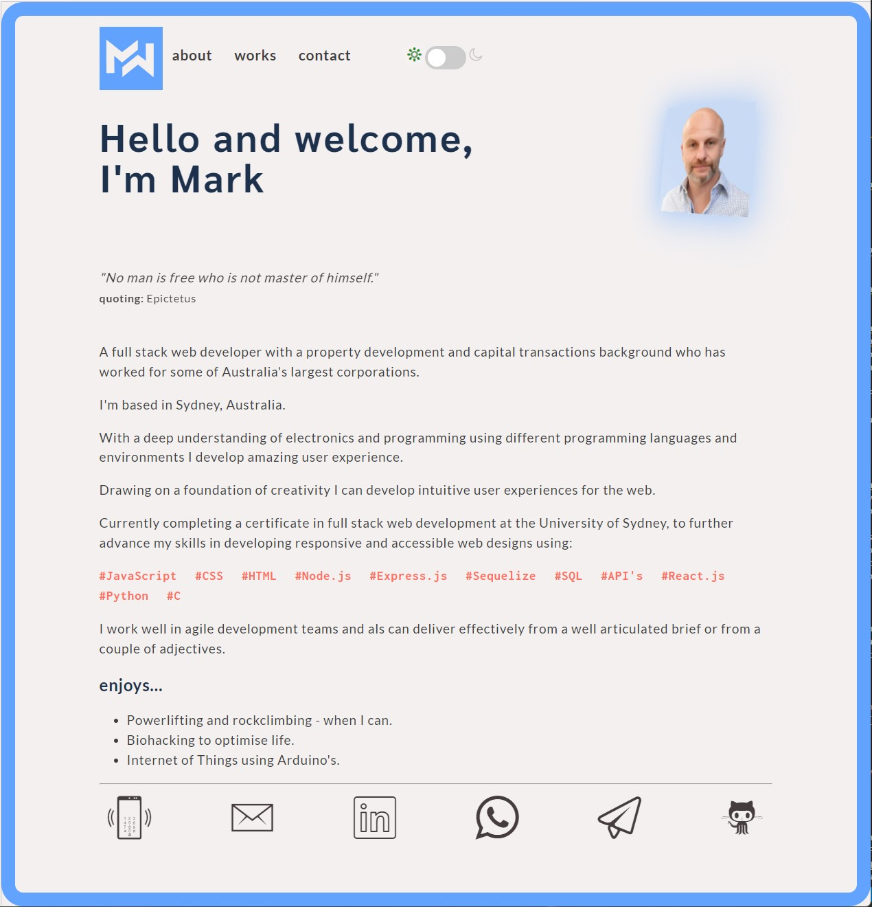
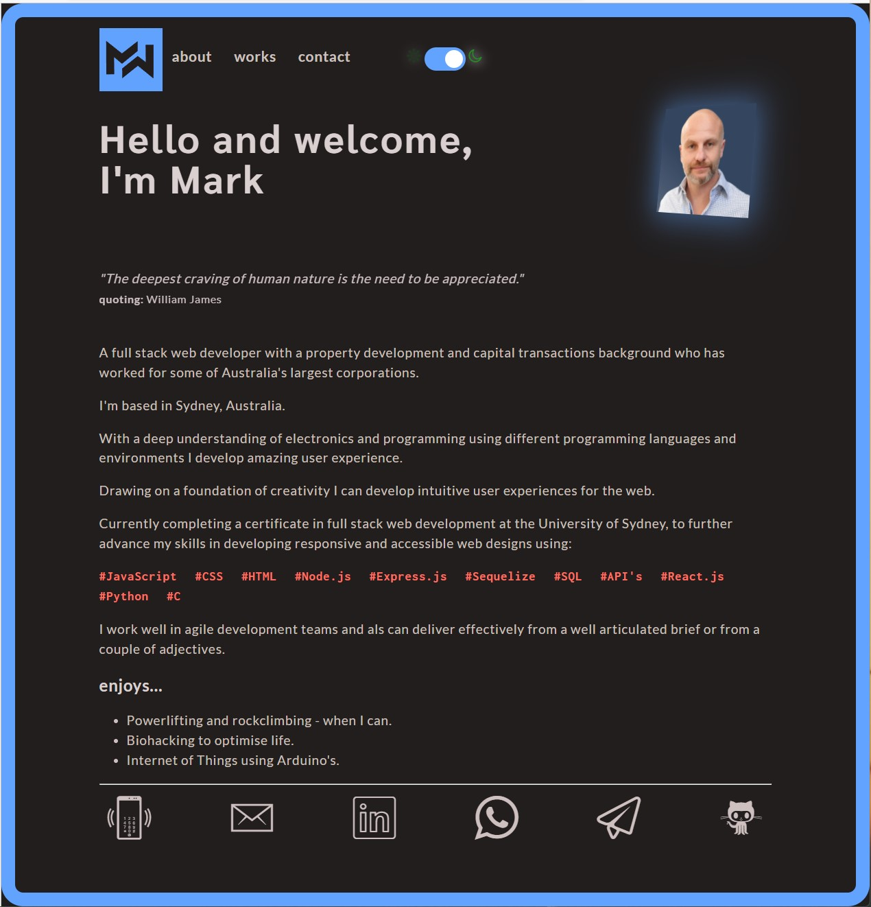
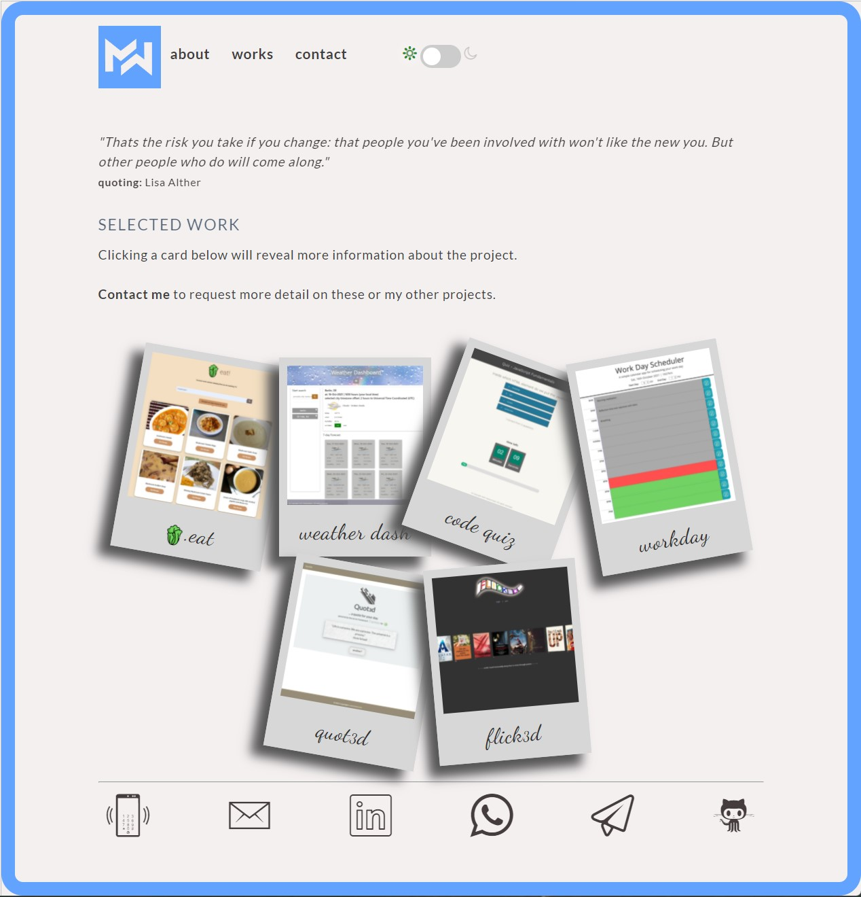
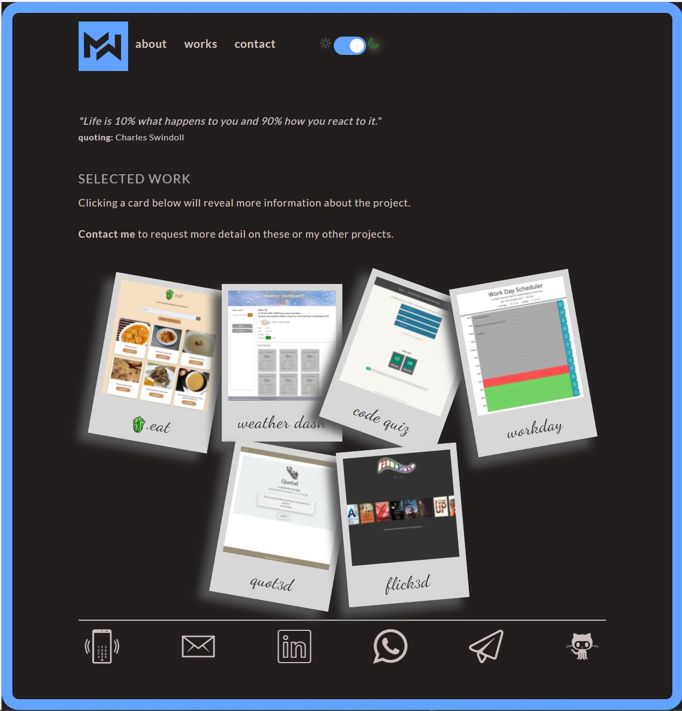
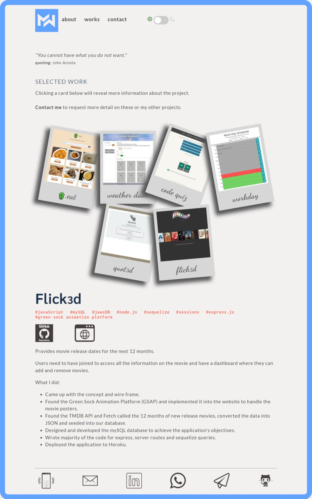
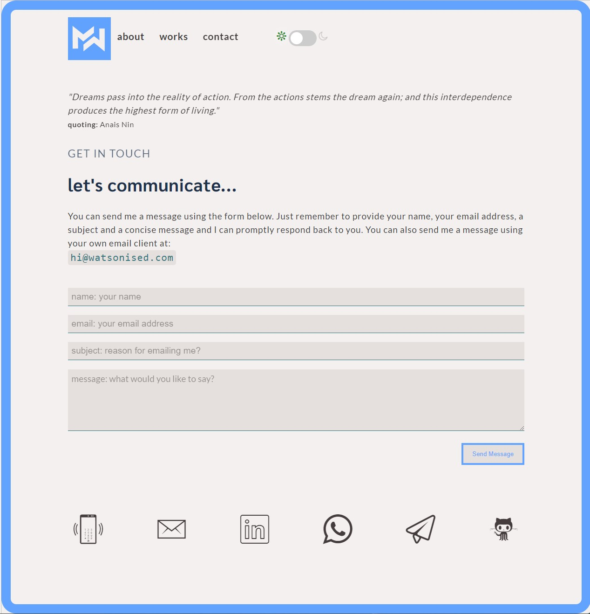
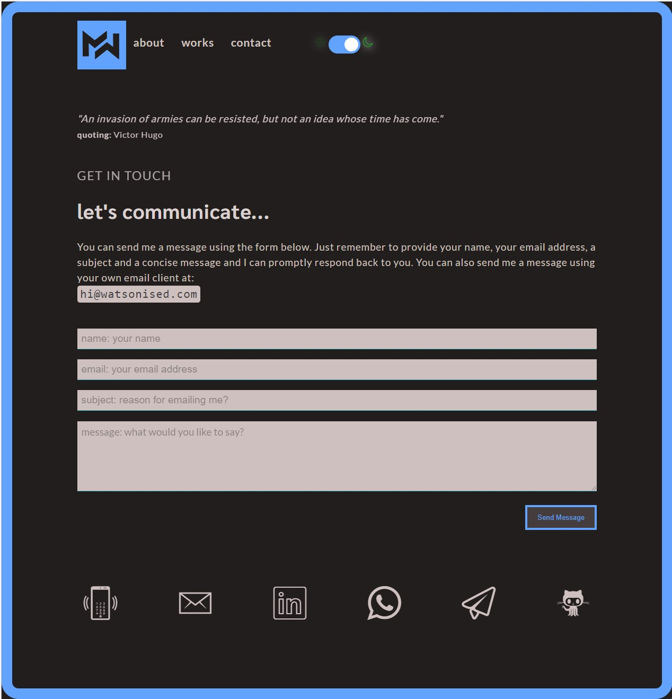
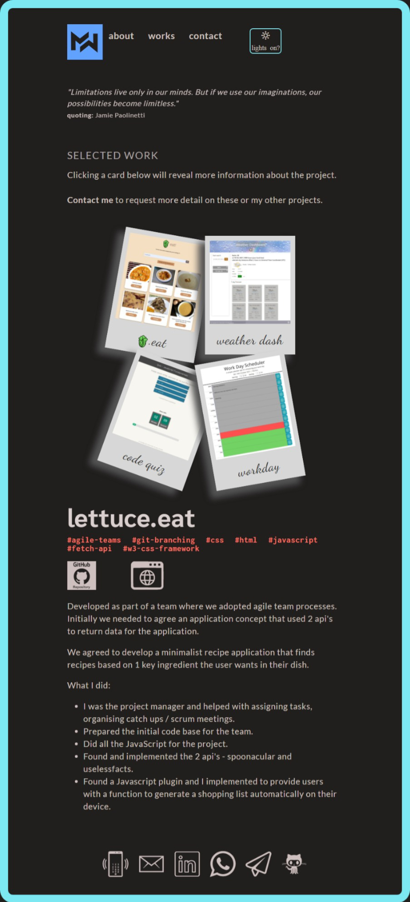

# USYD-FSF Week 16 Project

## Professional Materials 2

### Table of Contents  
  
   1. [Project Description](#1-description)
   2. [Application Features](#2-features)
   3. [Installation](#3-installation)
   4. [Usage](#4-usage)
   5. [Credits](#5-credits)
   6. [License](#6-license)
   7. [Repository Status](#7-github-repo-status)
   8. [Contribute](#8-how-to-contribute)
   9. [Tests](#9-tests)
   10. [Checklist](#10-checklist)

---

### 1. Description  

**What is this project?**  

* A further updated version of my portfolio webpage created in week 8 of the Bootcamp Course.  This update retains the week 8 styling and layout but improves on some UI including the addition of a night / day slider switch and 2 additional projects added to the gallery.  Link to my resume on the logo has the current updated resume as reviewed and signed off by the Bootcamp Careers Services team.

**Why this project?**  

* It is essential to have a good portfolio of professional materials to demonstrate your capability as a developer.  This project refines my previous work as demonstrated in the following screen grabs:

**What problem does this project solve?**  

* Provides a polished mobile responsive website to canvas my capability with links to my Github and LinkedIn for potential employers to consider me for employment.

**Lessons learnt?**  

* I considered completely reinventing this portfolio website.  After sanity checking my idea I revisted the website with a critical eye and decided it is still relevant in it's styling and functionality so I opted to comply with the assignment request of adding some more projects to the gallery.  In addition I also changed the night/day button to a sliding switch - bit more fun than the clunky button I did last time.

* This was also a good experience to appreciate setting out your code well from the beginning.  Revisting my code 8 weeks later felt like starting afresh.  It took me a little bit of time to remember some decisions I'd made however as I'd spent the time with indenting and annotating it didn't take long to remind myself of why I'd coded the way I had.  I still tidied up my code where I saw problems, biggest change was getting rid of the prefix b_ from the CSS.  Don't know why I thought that was a good idea now.

---

### 2. Features  

Updates as implemented:  

* CSS, HTML and JavaScript tidied up where needed.  Of mention I removed b_ suffix from the CSS.
* Updated resume saved in the /doc folder of the application.
* added another 2 examples from my bootcamp student work so the website now has 6 examples of my work.  Each example includes a project title, link to deployed version, link to the GitHub repository and a screenshot of the application.
* Reworked my picture so that my head follows the mouse as you'd expect.  I didn't have time to get it right when I did this assignment in week 8.  Now works better.
* Replaced the night / day button with a slider switch.  I like this more and consider it more contemporary than the awkward button I had before.
* the webpage is designed as 'mobile-first', has a color palette that doesn't use default CSS framwork's colours and has a styled expression.
* the webpage fonts and colours selected do not cause eye strain, although for this update I did do some resizing, including changing margins and padding to improve the UX.
* my GitHub page has a profile picture or avatar, biography, email address, link to deployed my deployed portfolio page and at least 2 pinned repositories.
* all my pinned projects include a README file.
* all pinned projects have a commit history.
* my downloadable resume has a heading with my name, phone number, professional email address, links to LinkedIn, portfolio and GitHub.
* my resume includes a technical skills section, with all programming languages and technologies listed.
* my resume has at least 3 of my strongest projects/homework assignments with a brief description, programming languages used, and URL.
* My LinkedIn Profile is updated with a strong bio statement, a professional photo, and links to your Github and portfolio.

---

### 3. Installation

You can download the source code from [my Github repository](https://github.com/Mark33Mark/FSF-dev-portfolio-2)  and open the index.html file to review the website inside your selected web browser.  
Alternatively, the webpage has also been hosted via [URL: hire.watsonised.com](https://hire.watsonised.com)

---

### 4. Usage  

The code can be downloaded from [my Github repository](https://github.com/Mark33Mark/FSF-dev-portfolio-2) for all assets created for the project.  
You can modify the code as you need.

---

### 5. Credits  

No specific credits for this updated project apart from again referencing W3-Schools for this project.  In particular I adopted W3-Schools solution / example for the toggle (slider) switch https://www.w3schools.com/howto/howto_css_switch.asp.

---

### 6. License  

 The works in this repository are subject to:  

---

### 7. Github repo status  

---

### 8. How to Contribute  

 If you would like to contribute, please comply with the Contributor Covenant Code of Conduct:  

---

### 9. Tests  

* No unit tests have been written for the application.  Testing on different devices has been completed.

---

### 10. Checklist  

 All actions not checked are still to be completed:  

[x]  Updated portfolio webpage with links to my GitHub and LinkedIn profiles.  
[x]  Webpage has a link for users to download a pdf version of my resume.  
[x]  Webpage showcases at least 3 examples from my bootcamp student work.  Each example includes a project title, link to deployed version, link to the GitHub repository and a screenshot of the application.  
[x]  Webpage has a polished and mobile-responsive user interface. [URL: hire.watsonised.com](https://hire.watsonised.com)  
[x]  Webpage is designed as 'mobile-first', has a color palette that doesn't use default CSS framwork's colours and has a styled expression;  
[x]  Webpage fonts and colours selected are not to cause eye strain.  
[x]  GitHub page has a profile picture or avatar, biography, email address, link to deployed my deployed portfolio page and at least 3 pinned repositories.  
[x]  All my pinned projects include a README file.  
[x]  All pinned projects have a commit history.  
[x]  Resume is downloadable and has a heading with my name, phone number, professional email address, links to LinkedIn, portfolio and GitHub.  
[x]  Resume includes a technical skills section, with all programming languages and technologies listed.  
[x]  Resume has 3 of my strongest projects/homework assignments with a brief description, programming languages used, and URL.  
[x]  LinkedIn Profile is updated with a strong bio statement, a professional photo, and links to your Github and portfolio.  
[x]  Application loads with no errors.  
[x]  Github repository contains application code [Github location](https://github.com/Mark33Mark/FSF-dev-portfolio-2)  
[x]  Repository has a unique name; follows best practice for file structure; and naming conventions.  
[x]  The application resembles the mock-up functionality provided in the assigment instructions.  
[x]  Repsository follows best practices for class/id naming conventions, indentation, quality comments, etc.  
[x]  Repository contains multiple descriptive commit messages.  
[x]  Repository contains a README file with descriptio, screenshot and link to deployed application.  

---

[Back to the top](#usyd-fsf-week-16-project)  
