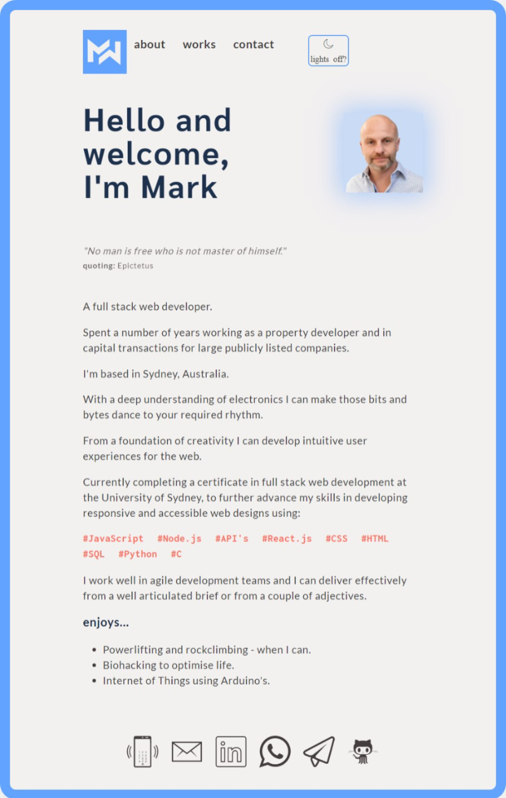
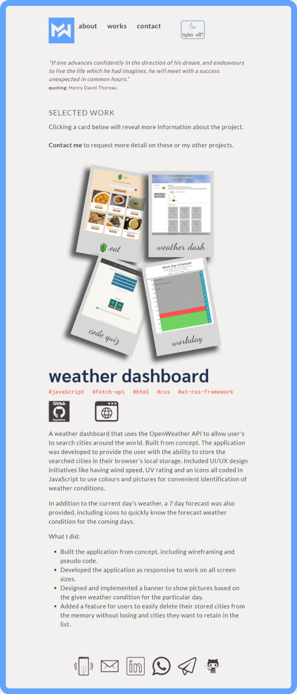
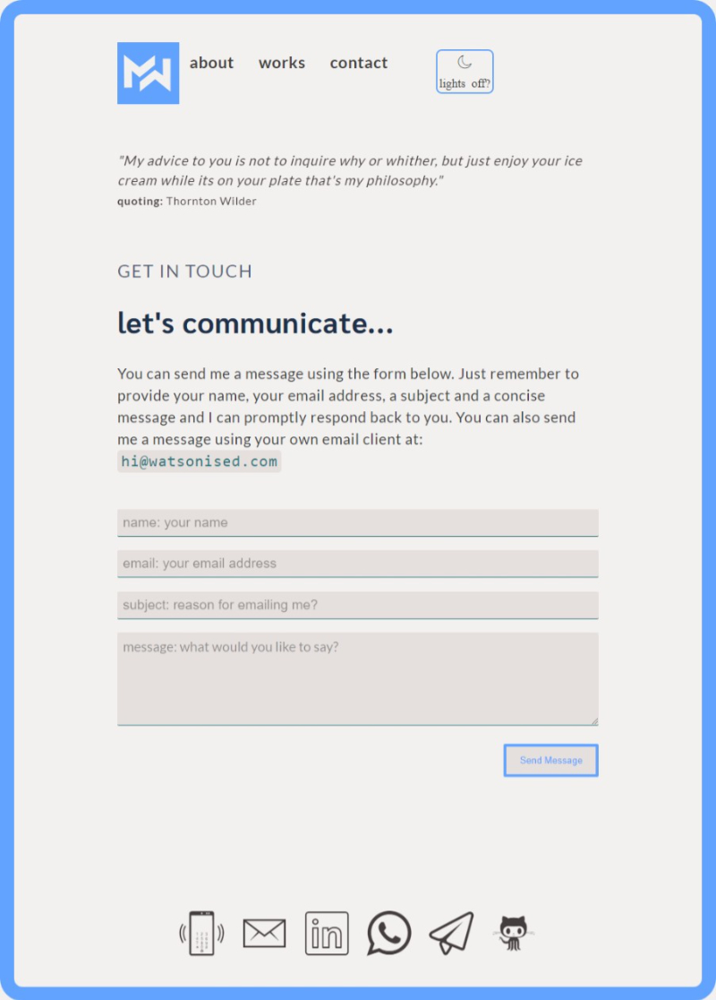

# USYD-FSF Week 16 Project
## Professional Materials 2

### Table of Contents  
  
   1. [Project Description](#1-description)
   2. [Application Features](#2-features)
   3. [Installation](#3-installation)
   4. [Usage](#4-usage)
   5. [Credits](#5-credits)
   6. [License](#6-license)
   7. [Repository Status](#7-github-repo-status)
   8. [Contribute](#8-how-to-contribute)
   9. [Tests](#9-tests)
   10. [Checklist](#10-checklist)

---
### 1. Description  
**What is this project?**  
* An updated version of my portfolio webpage created in week 2 of the Bootcamp Course.  This project provides potential employers with samples of my work for them to assess if I'm a good candidate for an open position.  

**Why this project?**  
* To find employment it is essential to have a good portfolio of professional materials to demonstrates my capability as a developer. 

**What problem does this project solve?**  
* Provides a polished mobile responsive website to canvas my capability with links to my Github and LinkedIn for potential employers to consider me for a job.

**Lessons learnt?**  
* Whilst I've improved with my implementation of ideas I need to improve with agreeing very early in the process what ideas are realistic for an MVP / assignment satisfying criteria.  I find I lose a lot of time playing with challenging ideas and then panic near the deadline that I'm not going to get an MVP that I'm at least happy with.
* A minimalist design is probably more work than a noisy busy page.  So much additional thought in styling is needed to work out how to handle elements to achieve minimalism.
* I spent a lot of time looking at a couple of alternative CSS frameworks, came close to using Bulma but decided to go it on my own.  I'm glad I did as there are convenient tools in the frameworks that I can easily build myself.
* GitHub does not provide PHP and they refer you to FormSpree.  I spent a bit of time on a PHP file that worked as I tested it on my host site only to find out that GitHub don't offer it.  The free, like all the free services, is a bit limited.  There is an auto-respond function / plugin but you need to pay minimum $8 per month for it.  I'm not doing it as I have the ability through my host site to do it.  Anyhow, users via the GitHub deployed site can still fill in the form and I'll receive their email, they just won't receive an auto-response.

---
### 2. Features  
Client requested features as implemented:  
- updated portfolio webpage with links to my GitHub and LinkedIn profiles.
- my webpage has a link for users to download a pdf version of my resume.
- my webpage showcases at least 2 examples from my bootcamp student work.  Each example includes a project title, link to deployed version, link to the GitHub repository and a screenshot of the application.
- the webpage has a polished and mobile-responsive user interface.
- the webpage is designed as 'mobile-first', has a color palette that doesn't use default CSS framwork's colours and has a styled expression;
- the webpage fonts and colours selected are not to cause eye strain.
- my GitHub page has a profile picture or avatar, biography, email address, link to deployed my deployed portfolio page and at least 2 pinned repositories.
- all my pinned projects include a README file.
- all pinned projects have a commit history.
- my downloadable resume has a heading with my name, phone number, professional email address, links to LinkedIn, portfolio and GitHub.
- my resume includes a technical skills section, with all programming languages and technologies listed.
- my resume has 3 of my strongest projects/homework assignments with a brief description, programming languages used, and URL.
- My LinkedIn Profile is updated with a strong bio statement, a professional photo, and links to your Github and portfolio.

---
### 3. Installation  
You can download the source code from [my Github repository](https://github.com/Mark33Mark/FSF-developer-portfolio)  and open the index.html file to review the website inside your selected web browser.  
Alternatively, the webpage has also been hosted via [URL: hire.watsonised.com](https://hire.watsonised.com)

---
### 4. Usage  
The code can be downloaded from [my Github repository](https://github.com/Mark33Mark/FSF-developer-portfolio) for all assets created for the project.  
You can modify the code as you need.

---
### 5. Credits  
I tried Bulma CSS framework for this assignment as an alternative to Bootstrap.  I found it worked well.
Thanks dcode for your youtube explaining how to use Fetch for POST commands - meant I could hook my email form up to my email server using a little php.  
[dcode's YouTube](https://www.youtube.com/watch?v=c3qWHnJJbSY)  
Also huge gratitude to all those souls that provide walkthroughs / how-to's / answer questions etc.  I relied heavily on stackoverflow forums for this assignment.

---
### 6. License  
 The works in this repository are subject to:  

---
### 7. Github repo status  

---
### 8. How to Contribute
 If you would like to contribute, please comply with the Contributor Covenant Code of Conduct:  

---
### 9. Tests  
- Opened on a Samsung Note 10+ and experienced full functionality and responsive behaviour was as expected.
- Opened on a Apple iPhone X - buttons not working or tooltips.  Swept my CSS with Autoprefixer but behaviour unchanged.  Did a web search and could not find any reasonable solutions, one site suggested moving buttons higher with z-index property but didn't try as it seems illogical and will interfere with the fixed navigation header.

---
### 10. Checklist  
 All actions not checked are still to be completed:
* [x]  Updated portfolio webpage with links to my GitHub and LinkedIn profiles.
* [x]  Webpage has a link for users to download a pdf version of my resume.
* [x]  Webpage showcases at least 2 examples from my bootcamp student work.  Each example includes a project title, link to deployed version, link to the GitHub repository and a screenshot of the application.
* [x]  Webpage has a polished and mobile-responsive user interface. [URL: hire.watsonised.com](https://hire.watsonised.com)
* [x]  Webpage is designed as 'mobile-first', has a color palette that doesn't use default CSS framwork's colours and has a styled expression;
* [x]  Webpage fonts and colours selected are not to cause eye strain.
* [x]  GitHub page has a profile picture or avatar, biography, email address, link to deployed my deployed portfolio page and at least 2 pinned repositories.
* [x]  All my pinned projects include a README file.
* [x]  All pinned projects have a commit history.
* [x]  Resume is downloadable and has a heading with my name, phone number, professional email address, links to LinkedIn, portfolio and GitHub.
* [x]  Resume includes a technical skills section, with all programming languages and technologies listed.
* [x]  Resume has 3 of my strongest projects/homework assignments with a brief description, programming languages used, and URL.
* [x]  LinkedIn Profile is updated with a strong bio statement, a professional photo, and links to your Github and portfolio. 
* [x]  Application loads with no errors.
* [x]  Github repository contains application code [Github location](https://github.com/Mark33Mark/FSF-developer-portfolio)
* [x]  Repository has a unique name; follows best practice for file structure; and naming conventions.
* [x]  The application resembles the mock-up functionality provided in the assigment instructions.
* [x]  Repsository follows best practices for class/id naming conventions, indentation, quality comments, etc.
* [x]  Repository contains multiple descriptive commit messages.
* [x]  Repository contains a README file with descriptio, screenshot and link to deployed application.

---

- [Back to the top](#usyd-fsf-week-16-project)